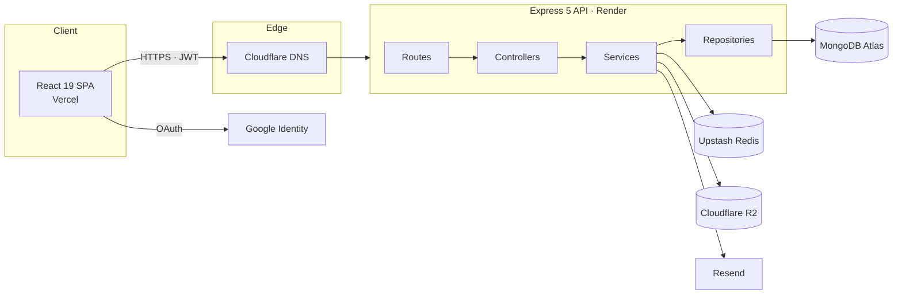

# Opportunity Quest

**The bridge between faculty and students — and the record of it.**

Opportunity Quest turns scattered, word-of-mouth academic opportunity into a structured, on-record exchange: faculty post internships, research roles, and paid work; students discover the ones they're actually eligible for and apply on equal footing. It runs in production for Thapar Institute as a multi-tenant product.

**Live:** [opportunityquest.agrimverma.dev](https://opportunityquest.agrimverma.dev)  ·  API: `api.opportunityquest.agrimverma.dev`


---

## Why this exists

Campuses are full of opportunity — research, papers, internships, paid projects — and almost none of it is discoverable. It lives in WhatsApp groups that scroll faster than anyone can read, on noticeboards nobody checks, and in the handful of conversations a professor has after class. If you're not in the group, you never hear about it. If you're not in that professor's section, the hallway conversation never happens.

The students who lose the most are the ones who aren't loud. An introvert rarely walks up to a professor to ask for a project, and when a connection does happen by chance, the student often takes whatever is offered — even when it sits far outside their interests — because finding another door, and working up the nerve to knock again, costs more than it should. Opportunity ends up handed out by proximity and confidence instead of by fit or merit.

There should be one place where faculty post what they need and every eligible student can see it, narrowed to their branch, year, and interests, and apply on the same footing as everyone else. No group to be in. No nerve required.

And once that exchange is structured, it's also *on record*. Every opportunity, application, and decision is captured — which gives a university something it has rarely had: visibility into faculty–student engagement as data rather than as folklore.

---

## What it is

A single-page React app on an Express + MongoDB API, built as a proper multi-tenant product rather than a demo. One deployment serves any institution: an organization is resolved from the email domain, and every query is scoped to it, so two universities on the same instance never see each other's data.

Three roles, each with a distinct surface:

- **Students** discover opportunities, apply with a cover letter and résumé, and track each application from submission to decision.
- **Faculty** post opportunities, run a disciplined applicant review, and message shortlisted candidates.
- **Coordinators** are the institution's trust anchor: they approve or reject faculty registrations, see org-wide analytics, and can post and manage opportunities themselves.

The interface is deliberately quiet — an academic "ink and gold" design system, built on design tokens with a hand-written component kit and no UI framework.

---

## Highlights

The parts worth a closer look:

- **Layered backend with a hard data boundary.** Every request flows Route → Controller → Service → Repository → Model. The repository is the *only* place that touches a collection, so business rules stay testable and the storage layer stays swappable.
- **Multi-tenancy isolated by construction.** Organizations are keyed by email domain; user and application queries lead with `organizationId` on compound indexes, and cross-tenant reads return *not found* rather than leaking existence. Covered by an isolation test.
- **Ownership-based authorization, not role sprawl.** Access is decided by who owns a record (`postedBy`, conversation participant), not by a growing matrix of roles. Adding "coordinators can post opportunities" was a one-line guard change because the checks were never role-bound in the first place.
- **Provider ports for storage, email, and cache.** Object storage (Cloudflare R2 / local disk), email (Resend), and the rate-limit cache (Redis) sit behind small interfaces selected by config — no business code changes to swap a provider.
- **Transactions with an append-only audit log.** Coordinator decisions (approve/reject) write the status change and the audit entry in one transaction; if the audit write fails, the whole thing rolls back. There's a test that forces exactly that failure.
- **Derived state instead of stored state.** A conversation's read-only status is derived from the live application status, and an opportunity's "expired" is derived from its deadline at query time — no schedulers, no flags to drift out of sync.
- **A rate limiter that fails open.** The Redis-backed limiter is wrapped so that if Redis is unreachable, requests are served instead of dropped — availability over strict limiting when the cache is down.
- **Referential integrity as first-class tooling.** MongoDB won't enforce foreign keys, so deleting a user is a cascade script (`deleteUser`), and a reconciliation sweep (`cleanupOrphans`) heals any drift from out-of-band edits, down to denormalized counters.

---

## Architecture



The server is organized so responsibilities don't bleed into each other:

| Layer | Owns | Never does |
| --- | --- | --- |
| **Routes** | URL shape, middleware wiring | business logic |
| **Controllers** | HTTP in/out, status codes | data access |
| **Services** | business rules, transactions, orchestration | Mongoose queries |
| **Repositories** | all database access | HTTP, business decisions |
| **Models** | schema, indexes, invariants | — |

Cross-cutting concerns live in middleware: JWT auth, role and ownership checks, Joi validation, NoSQL-operator sanitization, ObjectId guards, Helmet headers, and the rate limiters.

---

## Tech & infrastructure

**Frontend** — React 19, Vite, React Router, plain CSS on a design-token system (no component library), native `fetch`. Tested with Vitest + React Testing Library.

**Backend** — Node 20+, Express 5 (ESM), MongoDB via Mongoose, JWT + bcrypt, Google `google-auth-library`, Joi, Helmet, `express-rate-limit` + `rate-limit-redis`, Multer, Resend, AWS S3 SDK (for R2). Tested with Vitest + Supertest + `mongodb-memory-server`.

**Runs on** — Vercel (web), Render (API), MongoDB Atlas, Cloudflare (DNS + R2 object storage), Upstash Redis, Resend (email), on custom subdomains. CI is GitHub Actions.

---

## Feature tour

**Discovery & applications (students)**
- A server-paginated feed of active, in-date opportunities with search and branch/year/category filters.
- A strict eligibility gate — branch, year, gender — enforced on the server, not just hinted at in the UI.
- Apply with a required cover letter and an optional PDF résumé; duplicate applications are impossible at the database level, and re-applying after a withdrawal is gated by a cooldown.
- Every application tracked through a server-enforced state machine: **Applied → Viewed → Shortlisted → Selected / Rejected / Withdrawn**, with illegal transitions rejected.

**Posting & review (faculty)**
- Create and edit opportunities across four categories, with PDF attachments.
- A full lifecycle — **Active → Archived → Closed**, plus **Expired** derived from the deadline — with reactivation and deadline extensions that keep an audited change history.
- An applicant dashboard with a status pipeline and counts, résumé viewing, and one-to-one messaging with shortlisted or selected candidates.

**Governance (coordinators)**
- Faculty don't self-activate: they register as *pending* and a coordinator approves or rejects them (with a reason), every decision written to an append-only audit log and pushed as an in-app + email notification.
- Institution analytics — application funnel, opportunities by category and status, faculty roster, and a 30-day activity trend — all org-scoped.

**Across the platform**
- Google + password auth, domain-restricted, verified server-side; a Google identity links to an existing account by email on first sign-in.
- Application-scoped private messaging with per-participant unread counts and precise, dated timestamps.
- In-app notifications with selective email nudges (approvals, decisions, and messages email; routine events stay in-app).
- Résumés and avatars held in private storage and streamed only through authorized, ownership-checked routes.

---

## Security

- **Authentication:** JWT sessions (bcrypt-hashed passwords) and Google Identity, both restricted to recognized institutional domains and verified on the server.
- **Authorization:** role checks plus per-record ownership (IDOR) checks on every application, résumé, and conversation; mass assignment blocked by field whitelisting.
- **Tenant isolation:** every read is organization-scoped; cross-tenant access reads as *not found*.
- **Input & transport:** Joi schema validation, NoSQL-operator sanitization, ObjectId parameter guards, Helmet headers, CORS locked to a configured origin, and request-body size limits.
- **Abuse control:** global and per-route rate limiting backed by Redis, with a fail-open wrapper so a cache outage degrades limiting rather than the whole API.
- **Private files:** résumés are never served statically — only through an authenticated endpoint that checks ownership before streaming.

---

## Testing & CI

**91 automated tests**, gated in CI on every push:

- **61 API tests** (Vitest + Supertest against an in-memory MongoDB) drive real requests through the full stack — auth and RBAC, the eligibility gate, the application state machine, tenant isolation, the faculty-approval flow with its transaction rollback, Google sign-in and account linking, feed pagination and search, private file storage and authorized streaming, messaging, notifications, and analytics.
- **30 UI tests** (Vitest + React Testing Library) cover the component kit and page logic.

GitHub Actions lints, tests, and builds both the API and the web app on every push and pull request.

```bash
cd backend && npm test     # 61 API tests
cd frontend && npm test    # 30 UI tests
```

---

## Run it locally

**Prerequisites:** Node 20+, and a MongoDB connection string (Atlas or a local `mongod`).

```bash
git clone https://github.com/AgrimVerma11/OpportunityQuest.git
cd OpportunityQuest
cd backend && npm install
cd ../frontend && npm install
```

**`backend/.env`**
```bash
PORT=5174
MONGO_URI=mongodb+srv://<user>:<pass>@<cluster>.mongodb.net/opportunity-quest
JWT_SECRET=a-long-random-secret          # required; the server refuses to start without it
ALLOWED_ORIGIN=http://localhost:5173

# Optional integrations — the app runs without them in development:
GOOGLE_CLIENT_ID=                        # enables "Continue with Google"
STORAGE_DRIVER=local                     # local | r2   (R2 needs its own credentials)
EMAIL_PROVIDER=                          # e.g. resend  (needs EMAIL_FROM + provider key)
REDIS_URL=                               # rate-limit store; falls back to in-memory if unset
```

**`frontend/.env`**
```bash
VITE_API_URL=http://localhost:5174/api
VITE_GOOGLE_CLIENT_ID=                   # match the backend GOOGLE_CLIENT_ID (optional)
```

**Start both:**
```bash
cd backend && npm run dev     # API on http://localhost:5174  (node --watch)
cd frontend && npm run dev    # web on http://localhost:5173
```

Registration is restricted to institutional domains (`@thapar.edu` on this deployment), enforced server-side from the organization table. Seed a working dataset with `npm run seed` in `backend/`, then register a faculty and a student, post an opportunity, and apply.

---

## Operations

Coordinators are provisioned by an operator, and a few maintenance scripts keep the data honest:

```bash
# Provision the institution's coordinator (the approval trust anchor)
COORD_NAME="Name" COORD_EMAIL="coord@thapar.edu" COORD_PASSWORD="…" \
  node scripts/provisionCoordinator.js

# Remove a user and their entire footprint (opportunities, applications,
# conversations, messages, notifications) — never delete users by hand
USER_EMAIL="someone@thapar.edu" node scripts/deleteUser.js

# Heal any records/counters left dangling by an out-of-band edit
node scripts/cleanupOrphans.js

# Keep Mongoose indexes in sync with the schemas
npm run sync:indexes
```

---

## Repository layout

```
Opportunity-Quest/
├── backend/                 Express + MongoDB API
│   ├── config/              DB connection, Google client
│   ├── constants/           Domain constants (statuses, roles, notification policy)
│   ├── controllers/         HTTP in/out only
│   ├── services/            Business logic, transactions, orchestration
│   ├── repositories/        The single database boundary
│   ├── models/              Mongoose schemas + indexes
│   ├── middleware/          Auth, RBAC, validation, sanitization, rate limits, uploads
│   ├── lib/                 Storage, email, and cache provider ports
│   ├── validators/          Joi request schemas
│   ├── scripts/             Provisioning + maintenance tooling
│   └── tests/               API integration tests (Supertest + in-memory Mongo)
│
├── frontend/                React + Vite SPA
│   └── src/
│       ├── components/      The UI kit (Tag, Button, Card, StatCard, PageHero, …)
│       ├── pages/           Route-level screens
│       ├── context/         Auth session
│       ├── utils/api.js     Centralized fetch + JWT handling
│       └── tokens.css       Design tokens — the single source of truth for styling
│
├── docs/                    Architecture notes and phase records
├── render.yaml              API deploy blueprint
└── .github/workflows/ci.yml Lint · test · build (API + web)
```

---

## License

Copyright © 2026 Agrim Verma. All rights reserved.

Opportunity Quest is proprietary software. Its source code, design, and documentation may not be copied, modified, distributed, or used in any form, in whole or in part, without the author's prior written consent. See [LICENSE](LICENSE) for the full terms.

Licensing or permission inquiries: **agrim.works@gmail.com**
